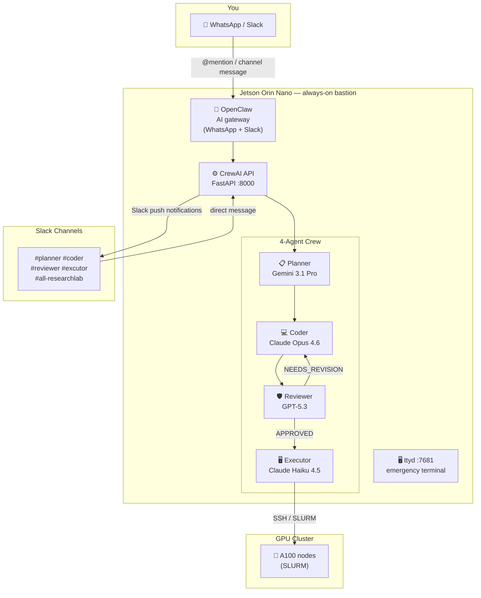

# remote_research

A personal AI research lab you can operate from anywhere — phone, tablet, or laptop.

Send a message on **WhatsApp or Slack**, and a crew of four specialized AI agents
plans, codes, reviews, and executes experiments on a GPU cluster via SSH.
The whole stack runs on a Jetson Orin Nano bastion host behind Tailscale zero-trust networking.

---

## Architecture



All traffic flows through **Tailscale** — no public IP, no open firewall ports.

---

## How It Works

### Talking to agents

**WhatsApp or any Slack channel** — use `@prefix` to route to a specific agent:

| Prefix | Agent | Model | Best for |
|--------|-------|-------|----------|
| `@planner` | Planner | Gemini 3.1 Pro | Research, literature survey, experiment design |
| `@reviewer` | Reviewer | GPT-5.3 | Code review, VRAM estimation, QA |
| `@coder` | Coder | Claude Opus 4.6 | Python / PyTorch / CUDA / Triton code |
| `@executor` | Executor | Claude Haiku 4.5 | Run jobs on the HPC cluster via SSH |
| `@flow <topic>` | Full pipeline | All 4 agents | End-to-end: plan → code → review → execute |

**Slack dedicated channels** — no `@prefix` needed:
- Any message in `#planner` → automatically goes to the Planner
- Any message in `#coder` → automatically goes to the Coder
- Same for `#reviewer` and `#excutor`

### Autonomous research pipeline (`@flow`)

```
@flow train a 7B MoE model with top-2 routing on 4 A100s

  Planner (Gemini)  ──→  Coder (Claude Opus)  ──→  Reviewer (GPT-5.3)
                              ↑                           │
                              └── NEEDS_REVISION ─────────┤  (up to 3 retries)
                                                          │
                                        APPROVED ──→  Executor (Haiku + SSH)
                                  circuit breaker ──→  @you alerted in Slack
```

### Real-time Slack notifications

Every key pipeline event is pushed to Slack as it happens:

```
🚀 Flow started — topic: train a 7B MoE model...
📋 Planner done — plan ready. > Objective: Benchmark top-2 gating...
💻 Coder done (attempt 1/3) — 312 lines written. Reviewer auditing…
✅ Reviewer APPROVED (attempt 1/3) — Executor running…
🖥️ Executor started — submitting job to HPC cluster via SSH…
✅ Flow complete — HPC job done.
```

If the circuit breaker fires (3 failed reviews), a `🚨` alert with `@you` is posted
to all four agent channels at once.

---

## Repository Structure

```
crewai-server/
  api.py                          # FastAPI server — all HTTP endpoints
  jobs.py                         # In-memory job store
  .env.example                    # Required environment variables (template)
  src/research_crew/
    crew.py                       # 4-agent crew + run_single_agent()
    flow.py                       # Autonomous pipeline (Plan→Code→Review→Execute)
    slack_notify.py               # Shared Slack posting helper
    config/
      agents.yaml                 # Few-shot prompts, VRAM formula, MoE templates
      tasks.yaml                  # Task definitions
    tools/
      hpc_ssh_tool.py             # paramiko SSH executor
      pylint_tool.py              # Pylint subprocess wrapper (Coder self-check)
      calculator_tool.py          # Safe eval() for VRAM/FLOPs arithmetic
    skills/
      __init__.py                 # SkillUtils, get_skill_context, validate_skills

deployments/
  docker-compose.yml              # ttyd container (ARM64, dark theme, port 7681)

scripts/
  install_gateway.sh              # Jetson: Tailscale + ttyd (idempotent)
  setup_ssh_trust.sh              # Jetson: generate ed25519 key + ssh-copy-id
  setup_macbook.sh                # MacBook: clone remotelab, npm install, pm2

tests/
  test_scripts.sh                 # bash -n syntax validation
  test_docker.sh                  # docker compose config validation

docs/
  DEVELOPMENT_GUIDE.md            # Full deployment walkthrough
  SECURITY_POLICY.md              # ZTNA rules, SSH key lifecycle, Tailscale ACLs

VIBE_LOG.md                       # Completed work log
SLACK_SETUP_GUIDE.md              # Slack bot setup reference
```

---

## Quickstart

### Prerequisites

- Jetson Orin Nano (Ubuntu 22.04, Docker pre-installed, always-on)
- [Tailscale](https://tailscale.com) account (free tier works)
- API keys: Anthropic, OpenAI, Google (Gemini), Brave Search
- GPU cluster reachable via SSH (optional — flow delivers code directly if unset)

### 1. Jetson — install gateway

```bash
ssh jetson
bash scripts/install_gateway.sh      # installs Tailscale + starts ttyd on :7681
bash scripts/setup_ssh_trust.sh user@<macbook-tailscale-ip>
```

### 2. Jetson — start CrewAI API server

```bash
cd ~/crewai-server
cp .env.example .env                 # fill in API keys
source .venv/bin/activate
pm2 start "uvicorn api:app --host 0.0.0.0 --port 8000" --name crewai-api
```

### 3. Slack bot setup

1. Create a Slack app with Socket Mode enabled
2. Add bot scopes: `chat:write`, `channels:history`, `app_mentions:read`
3. Install to workspace, copy bot token → `SLACK_BOT_TOKEN` in `.env`
4. Create channels: `#planner`, `#reviewer`, `#coder`, `#excutor`, `#all-researchlab`
5. Invite the bot to all five channels (`/invite @your-bot`)
6. See [SLACK_SETUP_GUIDE.md](SLACK_SETUP_GUIDE.md) for full details

### 4. Environment variables

```bash
# crewai-server/.env
ANTHROPIC_API_KEY=...
OPENAI_API_KEY=...
GOOGLE_API_KEY=...
BRAVE_API_KEY=...
SLACK_BOT_TOKEN=xoxb-...
SLACK_OWNER_ID=U...           # your Slack user ID (for @mention alerts)
HPC_HOST=gpu-cluster.example  # leave blank to skip execution, deliver code only
HPC_USER=your_username
HPC_KEY_PATH=~/.ssh/id_ed25519
OPENCLAW_GATEWAY_TOKEN=...    # from OpenClaw config
```

---

## API Reference

All endpoints are on `localhost:8000` (loopback only).

```bash
# Single agent
POST /agent/kickoff   {"agent": "coder", "task": "...", "source_channel_id": "C..."}

# Full autonomous pipeline
POST /flow/kickoff    {"topic": "...", "source_channel_id": "C..."}

# Job management
GET  /crew/status/{job_id}
GET  /crew/jobs
POST /crew/cancel/{job_id}

# Inspect full pipeline state (plan, code, reviewer feedback)
GET  /flow/state/{job_id}

GET  /health
```

---

## Agent Optimization Details

| Agent | Temperature | Tools | Specialty |
|-------|-------------|-------|-----------|
| Planner | 0.8 | ArxivPaperTool, BraveSearchTool | Complexity-matched plans; simple task → minimal plan |
| Coder | 0.15 | PyLintTool | Self-lints before submitting; MoE hook templates |
| Reviewer | 1.0 | CalculatorTool | VRAM formula + 7 known bug patterns + calibration examples |
| Executor | 0.0 | HPCSSHTool | SLURM/direct SSH with structured result reporting |

All agents use few-shot calibration examples in `config/agents.yaml`.
`ResearchCrew` uses `memory=True` with `text-embedding-3-small` for cross-session recall.

---

## Documentation

- [VIBE_LOG.md](VIBE_LOG.md) — full record of completed features
- [SLACK_SETUP_GUIDE.md](SLACK_SETUP_GUIDE.md) — Slack bot configuration
- [AGENT_TEST_RESULTS.md](AGENT_TEST_RESULTS.md) — test results and benchmarks
- [docs/DEVELOPMENT_GUIDE.md](docs/DEVELOPMENT_GUIDE.md) — deployment walkthrough
- [docs/SECURITY_POLICY.md](docs/SECURITY_POLICY.md) — ZTNA and SSH key lifecycle

---

## License

Documentation and scripts — use and adapt freely.
