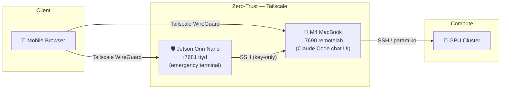

# remotelab

Control your servers from any browser — phone, tablet, or laptop.
Combines **Ninglo/remotelab** (Claude Code chat UI) with a Jetson Orin Nano bastion host and Tailscale zero-trust networking.

## Architecture



All ports are accessible only via Tailscale — no public IP or open firewall rules required.

## Quickstart

### 1. Jetson Orin Nano — bastion + emergency terminal

```bash
# SSH into the Jetson, then run (Docker is pre-installed):
ssh jetson
bash scripts/install_gateway.sh
```

This installs Tailscale and starts a ttyd container on port 7681.

### 2. Jetson — SSH trust to MacBook

```bash
# On the Jetson — replace with your MacBook's Tailscale IP or hostname
bash scripts/setup_ssh_trust.sh alice@100.x.x.x
```

### 3. MacBook — Claude Code chat server

```bash
# On the MacBook
bash scripts/setup_macbook.sh
# Then edit ~/remotelab-server/.env to set ANTHROPIC_API_KEY
cd ~/remotelab-server && npm run setup
pm2 start npm --name remotelab -- run chat
pm2 save && pm2 startup
```

Open `http://<macbook-tailscale-ip>:7690` on your phone to start chatting with Claude Code.

## Prerequisites

- Jetson Orin Nano (Ubuntu 22.04, Docker 29+ pre-installed, always-on)
- MacBook or any machine with Node.js >= 18
- GPU cluster (optional, reachable via SSH)
- [Tailscale](https://tailscale.com) account (free tier works)
- Anthropic API key — get one at [console.anthropic.com](https://console.anthropic.com)

## Repository Structure

```
deployments/
  docker-compose.yml     # ttyd container (ARM64, dark theme, port 7681)
scripts/
  install_gateway.sh     # Jetson: Tailscale + ttyd (Docker pre-installed, idempotent)
  setup_ssh_trust.sh     # Jetson: generate ed25519 key + ssh-copy-id to MacBook
  setup_macbook.sh       # MacBook: clone remotelab, npm install, pm2 daemon
tests/
  test_scripts.sh        # bash -n syntax validation for all .sh files
  test_docker.sh         # docker compose config validation
docs/
  DEVELOPMENT_GUIDE.md   # Full deployment walkthrough
  SECURITY_POLICY.md     # ZTNA rules, SSH key lifecycle, Tailscale ACLs
```

## Documentation

- [Development Guide](docs/DEVELOPMENT_GUIDE.md) — step-by-step deployment, network topology, troubleshooting
- [Security Policy](docs/SECURITY_POLICY.md) — zero-trust principles, SSH key lifecycle, Tailscale ACL examples

## License

Documentation and scripts — use and adapt freely.
