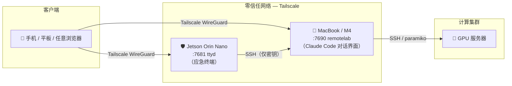

# remotelab 开发指南

## 1. 项目概述与核心思路

### 目标

将 **Web 终端** 集成到网页中，实现 **「有浏览器的地方就能控制服务器」**。你无需在本地安装 SSH 客户端，只要有一台能上网的设备（手机、平板、任意电脑），打开浏览器即可登录到 Jetson Orin Nano，再通过 SSH 跳转到你的 MacBook 或 GPU 服务器，在网页里完成所有终端操作。

### 与「手机 - Jetson - 电脑」架构的关系

本方案中，**Jetson Orin Nano** 充当 **堡垒机（Jump Server）**：

- **常驻在线**：作为统一的外部访问入口。
- **中转站**：手机只连 Jetson，Jetson 再通过 SSH 连接你的实验机（MacBook、GPU 服务器等）。
- **集中管理**：密钥、访问控制都集中在 Jetson 上，目标机只需信任 Jetson 即可。
- **本机亦可计算**：Jetson Orin Nano 自带 GPU，必要时也可作为轻量推理节点使用。

整体构成典型的 **堡垒机模式**：所有外部访问先到 Jetson，再由 Jetson 转发到内网机器，既安全又便于在外网（如手机 4G）下使用。

---

## 2. 网络拓扑结构



所有端口仅通过 Tailscale 可达，无需公网 IP 或开放防火墙端口。

### 角色说明

| 角色 | 设备 | 职责 |
|------|------|------|
| **客户端** | 手机、平板、任意带浏览器的设备 | 通过浏览器打开 Web 终端页面，在网页里输入命令 |
| **堡垒机** | Jetson Orin Nano（Ubuntu 22.04，aarch64） | 运行 ttyd（Docker 容器），将用户指令通过 SSH 转发到目标机 |
| **目标机** | MacBook、GPU 服务器等 | 接收来自 Jetson 的 SSH 连接，执行 AI 实验任务 |

**数据流**：浏览器 → Jetson（Web 终端）→ 用户在网页里输入 `ssh macbook` → Jetson 发起 SSH 到电脑 → 电脑上的终端输出回显到网页。

---

## 3. 实现步骤

### 步骤一：在 Jetson 上部署 Web 终端

Jetson Orin Nano 已预装 Docker 29 和 Docker Compose v2，直接用 docker compose 启动 ttyd 容器即可。无需手动安装 ttyd 或 Docker。

#### 连接 Jetson

```bash
# 在 MacBook 上
ssh jetson
```

#### 运行安装脚本

在 Jetson 上，克隆本仓库并执行安装脚本：

```bash
git clone <本仓库地址>
cd remote_research
bash scripts/install_gateway.sh
```

脚本会自动：
1. 安装 Tailscale（Docker 已存在，跳过）
2. 以 docker compose 启动 ttyd 容器（端口 7681，暗色主题，ARM64 镜像）

#### 手动启动（不用脚本）

```bash
cd deployments
docker compose up -d
```

#### 从手机/电脑访问

同一局域网内，浏览器打开：

```
http://Jetson局域网IP:7681
```

外网（配置 Tailscale 后）：

```
http://Jetson-Tailscale-IP:7681
```

---

### 步骤二：Jetson 到电脑的无密码登录

#### 在 Jetson 上生成 SSH 密钥

```bash
# 在 Jetson 上执行（或通过脚本）
bash scripts/setup_ssh_trust.sh <user>@<macbook-ip>
```

脚本会自动完成密钥生成、`ssh-copy-id`，并验证免密登录。

手动操作等价命令：

```bash
ssh-keygen -t ed25519 -C "jetson@remotelab" -f ~/.ssh/id_ed25519 -N ""
ssh-copy-id user@macbook-ip
```

#### 验证免密登录

```bash
ssh user@macbook-ip
# 无需输入密码即可登录说明配置成功
```

#### 配置 SSH config 方便记忆

在 Jetson 上编辑 `~/.ssh/config`：

```
Host macbook
    HostName <macbook-tailscale-ip>
    User your_username
Host gpu-server
    HostName <gpu-tailscale-ip>
    User your_username
```

之后在网页终端里输入 `ssh macbook` 或 `ssh gpu-server` 即可。

---

### 步骤三：手机远程访问（外网 / 非同一 Wi-Fi）

当手机和 Jetson 不在同一 Wi-Fi（例如手机用 4G）时，使用 **Tailscale** 组建虚拟局域网。

#### 安装并认证 Tailscale（Jetson 上）

```bash
# 安装（install_gateway.sh 已完成）
sudo tailscale up
# 按提示访问链接完成认证
```

#### 获取 Jetson 的 Tailscale IP

```bash
tailscale ip -4
# 返回类似 100.x.x.x 的地址
```

#### 手机访问

1. 手机安装 Tailscale App，用同一账号登录。
2. 浏览器打开 `http://100.x.x.x:7681`（将 IP 换为 Jetson 的 Tailscale IP）。

#### Jetson SSH 到电脑（跨 Tailscale）

若电脑也安装了 Tailscale，在 Jetson 的 `~/.ssh/config` 里用电脑的 Tailscale IP 作为 `HostName`，无论电脑在哪个网络都能 SSH 过去。

---

## 4. 实际操作体验与工作流

配置完成后，典型使用流程如下：

1. **手机浏览器** 打开 `http://Jetson-Tailscale-IP:7681`，进入 **Jetson 网页终端**。
2. 输入：
   ```bash
   ssh macbook
   ```
   进入 M4 MacBook 的终端。
3. 在同一网页终端里直接运行 AI 实验任务，终端输出实时显示在手机浏览器中。

或直接访问 MacBook 上的 Claude Code 对话界面：
```
http://MacBook-Tailscale-IP:7690
```

---

## 5. 故障排查与安全建议

### 常见问题

- **无法访问 `http://Jetson-IP:7681`**
  - 确认 ttyd 容器已运行：`docker compose ps`（在 `deployments/` 目录下）。
  - 若用 Tailscale，确认手机与 Jetson 均在线且在同一 Tailscale 网络：`tailscale status`。

- **SSH 仍要求输入密码**
  - 确认已用 `ssh-copy-id` 将 Jetson 公钥写入目标机的 `~/.ssh/authorized_keys`。
  - 确认目标机 `~/.ssh` 权限为 `700`，`authorized_keys` 为 `600`。

- **Tailscale 下无法 SSH 到电脑**
  - 确认电脑已安装并登录 Tailscale，在 Jetson 上用 `tailscale status` 检查连通性。
  - SSH config 中 `HostName` 改为电脑的 Tailscale IP。

### 安全建议

- **不要将 ttyd 直接暴露到公网且无鉴权**。建议仅在 Tailscale 网络使用。
- **SSH 私钥** 仅保存在 Jetson 上，不要复制到手机或不可信环境。
- 详细安全策略见 [SECURITY_POLICY.md](SECURITY_POLICY.md)。

---

## 步骤四：在 MacBook 上部署 Ninglo/remotelab 对话界面

ttyd 提供应急终端，而 [Ninglo/remotelab](https://github.com/Ninglo/remotelab) 则在 Claude Code 之上提供完整的聊天界面，支持 WebSocket 流式输出和会话管理，是主要的交互入口。

### 前置条件

- Node.js >= 18（检查：`node --version`）
- Anthropic API Key（在 [console.anthropic.com](https://console.anthropic.com) 获取）
- MacBook 已通过 Tailscale 连入虚拟网络

### 快速安装

在 MacBook 上运行：

```bash
bash scripts/setup_macbook.sh
```

脚本会自动完成：
1. 检测 Node.js 版本
2. 将仓库克隆到 `~/remotelab-server`
3. 执行 `npm install`
4. 创建 `.env` 模板（如不存在）
5. 安装 pm2（如未安装）

### 配置 API Key

```bash
nano ~/remotelab-server/.env
# 将 ANTHROPIC_API_KEY=your_api_key_here 改为实际值
```

### 启动并守护服务

```bash
cd ~/remotelab-server
npm run setup                              # 首次运行交互式配置
pm2 start npm --name remotelab -- run chat # 启动服务（端口 7690）
pm2 save                                   # 持久化进程列表
pm2 startup                                # 打印并执行开机自启命令
```

### 从手机访问

```
http://<macbook-tailscale-ip>:7690
```

### 完整访问路径

| 场景 | 入口 | 用途 |
|------|------|------|
| 正常使用 | `http://<macbook-ts-ip>:7690` | Claude Code 对话界面（推荐） |
| 应急访问 | `http://<jetson-ts-ip>:7681` | Jetson 原始终端（ttyd） |

---

本指南覆盖从拓扑到部署、无密码 SSH、外网访问、日常使用流程以及 Ninglo/remotelab 对话服务的完整部署步骤。安全配置与密钥管理请参阅 [SECURITY_POLICY.md](SECURITY_POLICY.md)。
