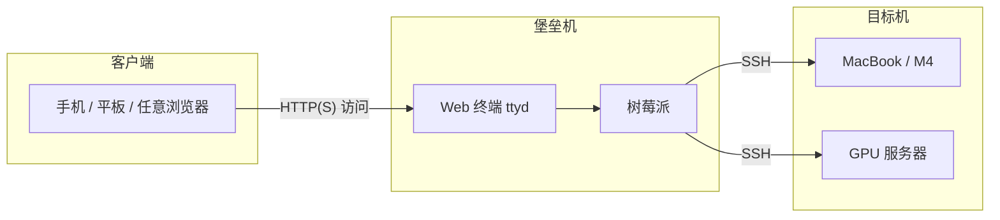

# remotelab 开发指南

## 1. 项目概述与核心思路

### 目标

将 **Web 终端** 集成到网页中，实现 **「有浏览器的地方就能控制服务器」**。你无需在本地安装 SSH 客户端，只要有一台能上网的设备（手机、平板、任意电脑），打开浏览器即可登录到树莓派，再通过 SSH 跳转到你的 MacBook 或 GPU 服务器，在网页里完成所有终端操作。

### 与「手机 - 树莓派 - 电脑」架构的关系

本方案中，**树莓派** 充当 **堡垒机（Jump Server）**：

- **24 小时在线、低功耗**：适合长期运行，作为统一入口。
- **中转站**：手机只连树莓派，树莓派再通过 SSH 连接你的实验机（MacBook、GPU 服务器等）。
- **集中管理**：密钥、访问控制都集中在树莓派上，目标机只需信任树莓派即可。

因此，整体构成典型的 **堡垒机模式**：所有外部访问先到树莓派，再由树莓派转发到内网机器，既安全又便于在外网（如手机 4G）下使用。

---

## 2. 网络拓扑结构



### 角色说明

| 角色 | 设备 | 职责 |
|------|------|------|
| **客户端** | 手机、平板、任意带浏览器的设备 | 通过浏览器打开树莓派上的 Web 终端页面，在网页里输入命令 |
| **堡垒机** | 树莓派 | 运行 Web 终端服务（如 ttyd），将用户在网页中的指令通过 SSH 转发到目标机 |
| **目标机** | MacBook、GPU 服务器等 | 接收来自树莓派的 SSH 连接，执行 CrewAI、MoE 等实验任务 |

**数据流**：浏览器 → 树莓派（Web 终端）→ 用户在网页里输入 `ssh user@电脑` → 树莓派发起 SSH 到电脑 → 电脑上的终端输出回显到网页。

---

## 3. 实现步骤

### 步骤一：在树莓派上部署 Web 终端

推荐使用 **ttyd**：把本地终端映射到指定端口，用浏览器即可访问，稳定、易部署。

#### 安装 ttyd（树莓派）

**方式 A：包管理器（推荐）**

```bash
# Debian / Raspberry Pi OS
sudo apt update
sudo apt install ttyd
```

**方式 B：从源码安装**

若系统源中版本过旧，可从 [ttyd 官方仓库](https://github.com/tsl0922/ttyd) 按文档编译安装。

#### 运行 ttyd

在树莓派上执行：

```bash
# 将终端映射到 7681 端口，使用 bash
ttyd -p 7681 bash
```

如需后台常驻，可使用 `systemd` 或 `screen` / `tmux`：

```bash
# 使用 tmux 后台运行示例
tmux new -s ttyd
ttyd -p 7681 bash
# Ctrl+B 然后 D 分离会话
```

#### 从手机/电脑访问

在同一局域网内，用浏览器打开：

```
http://树莓派IP:7681
```

例如树莓派 IP 为 `192.168.1.100`，则访问：`http://192.168.1.100:7681`。你会看到网页里出现一个终端，输入的命令在树莓派上执行。

**备选工具**：若需要文件管理可考虑 **Cloud Commander**；若后续自建 Web 终端服务，可参考本仓库的 remotelab 思路，在树莓派上运行自己的服务并反向代理到同一端口。

---

### 步骤二：树莓派到电脑的无密码登录

在网页终端里每次输入密码既麻烦又不安全。建议在树莓派上配置 **SSH 公钥**，实现树莓派 → 电脑的免密登录。

#### 在树莓派上生成 SSH 密钥

```bash
# 建议使用 ED25519
ssh-keygen -t ed25519 -C "pi@remotelab" -f ~/.ssh/id_ed25519 -N ""
```

默认会生成 `~/.ssh/id_ed25519`（私钥）和 `~/.ssh/id_ed25519.pub`（公钥）。

#### 将公钥拷贝到目标电脑

把树莓派的公钥写入目标机（MacBook 或 GPU 服务器）的 `~/.ssh/authorized_keys`：

```bash
# 在树莓派上执行，将 user 和 computer_ip 换成你的用户名与目标机 IP
ssh-copy-id user@computer_ip
```

按提示输入目标机的一次性密码即可。

#### 验证免密登录

在树莓派终端执行：

```bash
ssh user@computer_ip
```

若无需输入密码即可登录，说明配置成功。

#### 在网页终端中的用法

在手机浏览器打开的 ttyd 页面里，你实际上操作的是**树莓派的 shell**。因此只需输入：

```bash
ssh user@computer_ip
```

或若已在树莓派上配置 `~/.ssh/config` 的 Host（如 `macbook`）：

```bash
ssh macbook
```

即可「秒进」目标电脑的终端，在网页里继续执行 `crewai run` 等命令。

**可选：配置 SSH config 方便记忆**

在树莓派上编辑 `~/.ssh/config`：

```
Host macbook
    HostName 192.168.1.50
    User your_username
Host gpu-server
    HostName 192.168.1.60
    User your_username
```

之后在网页终端里输入 `ssh macbook` 或 `ssh gpu-server` 即可。

---

### 步骤三：手机远程访问（外网 / 非同一 Wi-Fi）

当手机和树莓派不在同一 Wi-Fi（例如手机用 4G）时，需要解决 **内网穿透** 或 **虚拟组网**，让手机能访问到树莓派的 Web 终端端口。

#### 方案 A：Tailscale（推荐）

Tailscale 会在手机、树莓派、电脑之间建立一个 **虚拟局域网**，每台设备获得一个固定 Tailscale IP，无需公网 IP 或端口映射。

1. **在树莓派上安装 Tailscale**  
   参见 [Tailscale 官方文档](https://tailscale.com/download/linux)，按系统选择安装方式并登录同一账号。

2. **在手机和电脑上安装 Tailscale**  
   安装 App 或客户端，使用同一账号登录。

3. **获取树莓派的 Tailscale IP**  
   在树莓派上执行 `tailscale ip -4`，记下返回的 IP（如 `100.x.x.x`）。

4. **手机访问**  
   手机浏览器打开：`http://100.x.x.x:7681`（将 `100.x.x.x` 换为树莓派 Tailscale IP）。  
   这样无论手机在何处，只要 Tailscale 连通，即可访问 Web 终端。

5. **从树莓派 SSH 到电脑**  
   若电脑也安装了 Tailscale，可在树莓派的 `~/.ssh/config` 里用电脑的 Tailscale IP 或主机名作为 `HostName`，这样即使电脑在内网，树莓派也能通过 Tailscale 网络 SSH 过去。

#### 方案 B：frp 或 cpolar（端口映射到公网）

若不想用 Tailscale，可将树莓派的 7681 端口通过 **frp** 或 **cpolar** 映射到公网，手机通过公网地址访问。

- **安全注意**：  
  - 务必为 ttyd 或反向代理配置**认证**（如 Basic Auth、Token），避免未授权访问。  
  - 建议再套一层 **HTTPS**（如用 Caddy/nginx 反向代理 + Let's Encrypt），防止流量被窃听。

具体 frp/cpolar 的服务器端与客户端配置请参考各自官方文档，将树莓派上的 `localhost:7681` 映射到公网即可。

---

## 4. 实际操作体验与工作流

配置完成后，典型使用流程如下：

1. **手机浏览器** 打开 `http://树莓派IP:7681`（同一 Wi-Fi）或 `http://树莓派TailscaleIP:7681`（外网）。
2. 进入 **网页终端**，输入：
   ```bash
   ssh macbook
   ```
   （或 `ssh user@computer_ip`）进入 M4 MacBook（或目标机）。
3. 在 **同一网页终端** 里直接运行：
   ```bash
   crewai run
   ```
   Gemini/Claude 在目标机上规划、写代码，终端输出实时显示在手机浏览器中；若流程中有确认步骤（如输入 `Y`），在手机上即可完成操作。

这样你就实现了：**手机 → 树莓派（堡垒机）→ 电脑（实验机）** 的完整链路，真正做到了「有浏览器的地方就能控制服务器」。

---

## 5. 故障排查与安全建议

### 常见问题

- **无法访问 `http://树莓派IP:7681`**  
  - 确认树莓派上 ttyd 已启动：`ps aux | grep ttyd`。  
  - 确认树莓派防火墙放行 7681：`sudo ufw allow 7681`（若使用 ufw）。  
  - 若用 Tailscale，确认手机与树莓派均在线且在同一 Tailscale 网络。

- **SSH 仍要求输入密码**  
  - 确认已用 `ssh-copy-id` 将树莓派公钥写入目标机的 `~/.ssh/authorized_keys`。  
  - 确认目标机 `~/.ssh` 权限为 `700`，`authorized_keys` 为 `600`。

- **Tailscale 下无法 SSH 到电脑**  
  - 确认电脑已安装并登录 Tailscale，在树莓派上用 `ping 电脑TailscaleIP` 或 `tailscale status` 检查连通性。  
  - SSH config 中 `HostName` 改为电脑的 Tailscale IP 或主机名。

### 安全建议

- **不要将 ttyd 直接暴露到公网且无鉴权**。建议仅在内网或 Tailscale 网络使用；若必须经 frp/cpolar 暴露，请加认证并启用 HTTPS。
- **树莓派与目标机** 保持系统与 SSH 服务更新，使用强密码或仅密钥登录，关闭不必要的端口。
- **SSH 私钥** 仅保存在树莓派上，不要复制到手机或不可信环境。

---

本指南覆盖从拓扑到部署、无密码 SSH、外网访问与日常使用流程。若你在此基础上自建 remotelab Web 终端服务，可将 ttyd 替换为自研服务，并保持「堡垒机 + 浏览器」的整体架构不变。
